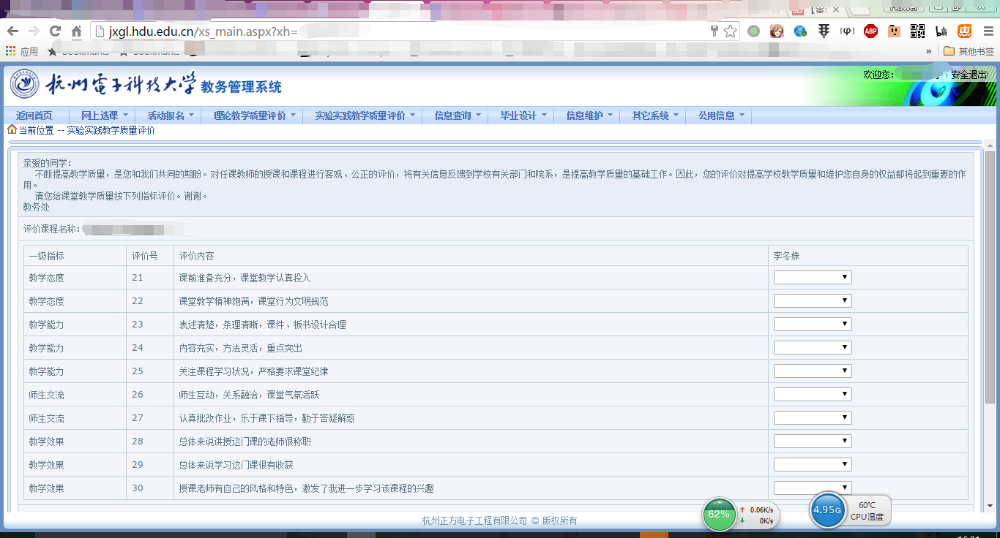
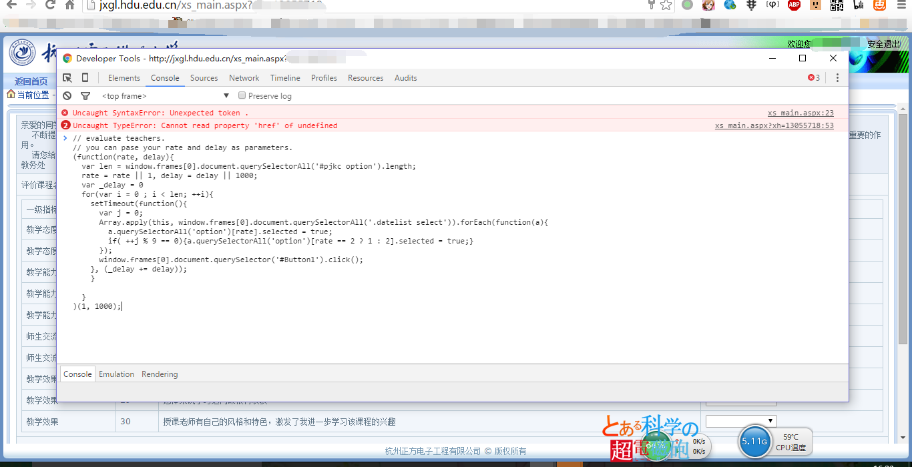
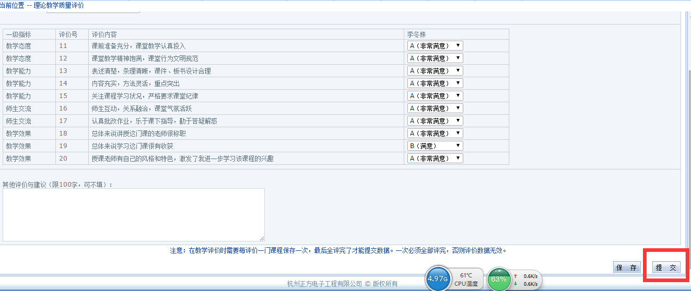

#Usage
##Step1
打开评教页面

##Step2
打开控制台 (chrome：windows按F12, MacOS 按 cmd + option + i。IE: F12或者右键检查元素。 Safari 请先开启开发模式。)

粘贴 evaluate.js 的代码到控制台

回车

##Step4
###别忘记点提交！！！

###别忘记点提交！！！

###别忘记点提交！！！

